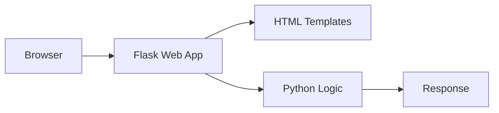

# Simple Web Application

A minimal [Python Flask](https://flask.palletsprojects.com/) web application used as the demo app in the [KodeKloud Docker for Beginners](https://kodekloud.com/courses/docker-for-the-absolute-beginner-hands-on/) course.

The app exposes two routes:

| Route | Response |
|---|---|
| `/` | `Welcome!` |
| `/how-are-you` | `I am good, how about you?` |

## Run manually (without Docker)

These steps assume a fresh machine.

1. Select an OS - Ubuntu

2. Update the package index:

   ```bash
   sudo apt-get update
   ```

3. Install Flask (this also pulls in Python 3):

   ```bash
   sudo apt-get install -y python3-flask
   ```

4. Set the Flask app environment variable:

   ```bash
   export FLASK_APP=app.py
   ```

5. Start the application:

   ```bash
   flask run --host=0.0.0.0
   ```

Then open `http://localhost:5000` and `http://localhost:5000/how-are-you` in a browser.

## Run with Docker

```bash
git clone https://github.com/mmumshad/simple-webapp-flask.git
cd simple-webapp-flask
docker build -t simple-webapp-flask .
docker run -p 5000:5000 simple-webapp-flask
```

Then open `http://localhost:5000` and `http://localhost:5000/how-are-you` in a browser.

## The Dockerfile

```dockerfile
FROM ubuntu

RUN apt-get update
RUN apt-get install -y python3-flask

COPY app.py /opt/app.py

ENV FLASK_APP=/opt/app.py

ENTRYPOINT ["flask", "run", "--host=0.0.0.0"]
```

Each instruction mirrors one of the manual steps above — making it easy to see how a Dockerfile is just an automated install script.

# Student Contribution

## Developer Information

- Name: Miguel Angel Alvarez Ibarra
- University: Universidad Tecnológica del Norte de Guanajuato
- Date: 2026-06-01

## Proposed Improvements

1. Mejorar la documentación de instalación
2. Agregar ejemplos de uso de la API
3. Implementar pruebas automatizadas

## Observations

This project is a simple yet effective Flask web application that demonstrates
core web development concepts. The codebase is clean and easy to understand,
making it ideal for learning purposes.

---

## Project Strengths

1. **Simplicidad** - El código es limpio y fácil de entender para desarrolladores nuevos.
2. **Tecnología probada** - Usa Flask, un framework Python maduro y bien documentado.
3. **Despliegue sencillo** - Puede levantarse con pocos comandos sin configuración compleja.
4. **Portabilidad** - Funciona en cualquier entorno con Python instalado.
5. **Base sólida** - Sirve como punto de partida para aplicaciones web más complejas.

---

## Improvement Opportunities

1. **Pruebas unitarias** - El proyecto carece de tests automatizados.
2. **Variables de entorno** - Las configuraciones deberían manejarse con `.env`.
3. **Dockerización** - Agregar un `Dockerfile` para estandarizar el entorno.
4. **CI/CD** - Integrar GitHub Actions para automatizar pruebas y despliegue.
5. **Logging** - Implementar un sistema de logs estructurado para monitoreo.

---

## Technologies Used

| Technology | Version | Purpose             |
|------------|---------|---------------------|
| Python     | 3.x     | Lenguaje base        |
| Flask      | 2.x     | Framework web        |
| HTML       | 5       | Interfaz de usuario  |
| CSS        | 3       | Estilos              |
| Git        | 2.x     | Control de versiones |

---

## Architecture Diagram



---

## Functional Requirements

| ID    | Description |
|-------|-------------|
| RF-01 | The system shall display a welcome message on the home page. |
| RF-02 | The system shall respond to HTTP GET requests on the root route. |
| RF-03 | The system shall render HTML templates dynamically. |
| RF-04 | The system shall run on a configurable port. |
| RF-05 | The system shall handle 404 errors gracefully. |
| RF-06 | The system shall support environment-based configuration. |
| RF-07 | The system shall be deployable via Docker. |
| RF-08 | The system shall log incoming requests. |
| RF-09 | The system shall support multiple routes. |
| RF-10 | The system shall return appropriate HTTP status codes. |

## Team Members

| Name | Role |
|------|------|
| Miguel Angel Alvarez Ibarra | Developer |


## ScreenShots & Evidences


-- Link from my repository (dev) to mmumshad repositories (master)
https://github.com/mmumshad/simple-webapp-flask/pull/74


-- Link from feature/profile to dev on my own repository
https://github.com/MiguelAlvarezIbarra/simple-webapp-flask/pull/1

